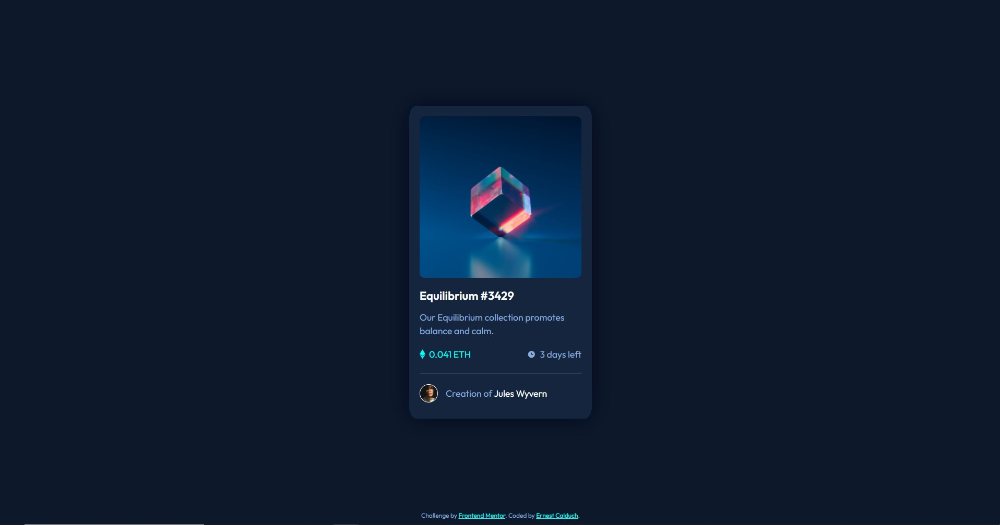

# Frontend Mentor - NFT preview card component solution

This is a solution to the [NFT preview card component challenge on Frontend Mentor](https://www.frontendmentor.io/challenges/nft-preview-card-component-SbdUL_w0U). 

## Table of contents

- [Overview](#overview)
  - [The challenge](#the-challenge)
  - [Screenshot](#screenshot)
  - [Links](#links)
- [My process](#my-process)
  - [Built with](#built-with)
  - [What I learned](#what-i-learned)
  - [Continued development](#continued-development)
- [Author](#author)
- [Acknowledgments](#acknowledgments)

**Note: Delete this note and update the table of contents based on what sections you keep.**

## Overview

### The challenge

Users should be able to:

- View the optimal layout both on pc and on mobile
- See hover states for the 3 interactive elements

### Screenshot

### Links

- Solution URL: [GitHub](https://github.com/ErnestCalduch/NFT-preview-card)
- Live Site URL: [Netlify](https://nft-preview-card-component-ernestcalduch.netlify.app/)

## My process

### Built with

- Semantic HTML5 markup
- CSS custom properties and variables for the colors
- Flexbox
- Mobile adapted

### What I learned

- Different ways to work with flexbox based on a fixed multi-column layout
- Making full use of CSS variables (colors)
- Working with the visibility of overlay DIV's
- Making an element stick to the bottom of page

### Continued development

I'd like to refine and perfect the visibility control of hidden elements.

## Author

- Frontend Mentor - [@ErnestCalduch](https://www.frontendmentor.io/profile/ErnestCalduch)

## Acknowledgments

I'd like to thank [@Nzone56](https://www.frontendmentor.io/profile/Nzone56) because his solution helped me understand the svg and tint rollover solution.
